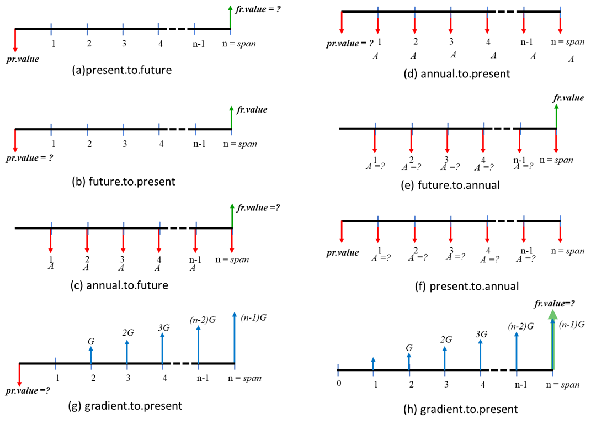

--- 
title: "EngrEcon R-package"
author: "Liya Abera and S. Kyle McKay"
date: "April 2023"
output:
  html_document: default
  word_document: default
description: The U.S. Army Engineer Research and Development Center (ERDC) has developed an R-package for conducting standard engineering economics methods and computing life cycle cost analysis. This report documents the development of this tool, including information on model scoping, the development process, and error-checking.
github-repo: USACE-WRISES/LifeCycleCost-report
---

# Front Matter {-}

<span style="color: red;">DRAFT REPORT UNDERGOING REVIEW AND USACE CERTIFICATION</span>

The final, reviewed report can be downloaded here. (<span style="color: red;">ADD LINK LATER</span>)

The R-package may be downloaded here. (<span style="color: red;">ADD LINK LATER</span>)

Points of Contact:

Liya Abera, Ph.D. 
liya.eshetu.abera at gmail.com
Environmental Laboratory  
Oxford, MS 38677

S. Kyle McKay, Ph.D., P.E.  
kyle.mckay at usace.army.mil  
Phone: 970-980-9747  
Environmental Laboratory  
New York, NY 10278


```{r, echo=FALSE, include=FALSE}
#Markdown options
knitr::opts_chunk$set(echo=FALSE, warning=FALSE, message = FALSE) 

##########
#Load all necessary R packages
library(devtools)

#Downloads the package and stores locally
install_github("USACE-WRISES/LifeCycleCost-package")

#Loads the most recent version of the package
library(lcca)

#This is eventually the line to load the package once it is on the CRAN site
#library(engrecon)
```

# Abstract

In engineering projects analyzing economic decision-making problems is of the crucial components. Recently, several innovative alternative solutions have been developed for engineering projects in addition to traditional infrastructure. When there are many alternatives, the triple bottom line frame is commonly used to measure the sustainability of alternatives and select the best solution. The triple bottom line frame measures a project's or business's effectiveness in three areas. One of these areas is economic or profit analysis. For engineering projects, engineering economic analysis is performed to analyze the cost of alternatives. 

An R package (engreco) was developed with several engineering economic analysis functions, also available via github. The main objective of the package is to add engineering economic analysis functions to the R-package development pool for convenient use for R users. Cash-flow diagrams are also included in the description document to show how each function calculates the time value of money. The package contains 11 functions with commonly used economic analysis equations; this package's possible use includes analyzing fixed and incremental costs, comparing alternatives, and cost estimation. The package is not only for engineering projects; anyone can use these basic functions to perform any economic analysis, including personal financing, such as investment and retirement plans. 


# Introduction

In engineering projects, a project's financial cost feasibility must be considered in addition to the physical feasibility. Engineering economics is a specific area that applies economic analysis techniques in engineering projects. Engineering economics evaluates the costs of engineering projects' services, products, and systems; engineering design alternatives will be compared based on these cost analyses. Not only the costs but also evaluates the revenues and benefits that occur at different times of a project's life. 

Engineering economic analysis evaluates a project's cost feasibility or economic effectiveness. The cost analysis considers all of the costs, which are direct and indirect, related to the project. Direct costs include labor and material costs, and indirect costs include planning, design, and administrative costs. The overall engineering project costs can be classified as (1) initial cost, which is the capital cost of the project, (2) annual cost, which is the operation cost or any other costs that occur yearly; and (3) future cost, which includes maintenance or rehabilitation cost. These costs occur at different times of a project year, and the combination of all the costs during the project's life is called life-cycle costs (WBDG, 2016). In order to pick the cost-efficient option from different project alternatives, converting the costs to the same time is essential. Almost all the time, engineering project costs occur during the design and building stages, and revenue or benefits occur after completion (David & Terry, 2012). 

For instance, recently, nature-based solutions (NbS) actions are getting more interest than engineered solutions in the public and private sectors. NbS are getting the favor due to their benefits in protecting, managing, or restoring nature. The costs of implementing these practices must be fully understood in addition to their benefits, which will help to select the optimum design. In order to explain that these alternatives are better and help make the right decision (Choice), engineering economic analysis will play a critical role in quantifying the costs and benefits.  

To perform cost analyses understanding the cash flow of the alternatives is essential. Cash flow tells us the sum of money recorded as an expense or gain in a project's life time. The timing of cash flows over the project's life is a crucial factor of cost analysis. Cash inflow or positive cash flow is money coming into a firm/agency, and cash outflow or negative cash flow is money paid out by a firm/agency. The net cash flow is the difference between total cash inflows and the total cash outflows for a specific period. This period is usually called a lifetime (design life) in engineering projects. The amount of money and the point at which it is received or paid is a crucial components of any economic analysis. 
This R-package is developed to provide a convenient way of performing engineering economic analyses. Several sets of engineering cost analysis functions are included in the package. The functions convert single, uniform serious, and uniform gradient payments to the equivalent cost. The functions in this package were developed based on the basic engineering economic equations (David & Terry, 2012; Newnan et al., 2020). 

Furthermore, engineering economics tools can also be applied to personal finances. Such as understanding the time value of money, investments, loans, savings, and taxes. 


# Methods

Discount factors are used to compute the equivalent costs that occurred at different cash flow points. The R functions are developed for single, uniform series, and uniform gradient payments. List of symbols used in the R-package: 

- _A_: annual equivalent value.  
- _F_: future value.  
- _G_: uniform gradient equivalent.  
- _i_: discount rate in percent per year (decimal format).  
- _idc_: interest during construction.  
- _n_: project life span and/or economic planning horizon in years.  
- _P_: present value.  


```{r, echo=FALSE, fig.cap="Figure 1. Engineering economics cash flow diagrams."}

```


## Single Payment Functions

`present_to_future`: This function computes the equivalent future value (fr.value) of any present value (pv.value) at a point of a cash flow. 

$F = P(1+i)^n$

Example use 
```{r echo=TRUE}
# For
  # i= 2.75%
  # n = 30 years
  # PV = 800,000
present_to_future(0.0275,30,800000)
# it returns fr.value = 1805281
```

`future_to_present`: This function combine future single payment or cost to present value. 

$P = \frac{F}{(1+i)^n}$

Example use
```{r echo=TRUE}
# For
  # i= 2.75%
  # n = 30 years
  # FV = 800,000
future_to_present(0.0275,30,800000)
# it returns pr.value = 35451
```

## Uniform Series Payment

`annual_to_future`: determines the future value from the annual equivalent payment series or income that start at the end of the first year and continue for the life span of a project. The cash flow repeats at the end of each year without changing the amount. 

$F = A \frac{(1+i)^n-1}{i}$

Example use
```{r echo=TRUE}
# For
# i = 0.0275
# n = 30
# A = 30000
annual_to_future(0.0275,30,30000)
# it returns future value = 1370838
```
`annual_to_present`: determines the present value or cost from a series of annual values/costs that starts at the end of the first year and continues for the life span of a project. 

$F = A \frac{(1+i)^n-1}{i(1+i)^n}$

Example use
```{r echo=TRUE}
# For
# i = 0.0275
# n = 30
# A = 30000
annual_to_present(0.0275,30,30000)
# it returns present value= 607479
```

`future_to_annual`: determines the future value after n periods of an annuity. 

$A = F \frac{i}{(1+i)^n-1}$

Example use
```{r echo=TRUE}
# For
 # i = 0.0275
 # n = 30
 # FV = 800000
future_to_annual(0.0275,30,100000)
# it returns annual value = 2188.442
```

`present_to_annual`: a comparison of alternatives based on their present value is misleading when the lifespan of the alternative value is different. The capital recovery factor converts each alternative's present value to an equivalent annual. The present.to.annual function can be used to make this conversion and comparison. 

$A = P \frac{i(1+i)^n}{(1+i)^n-1}$

Example use
```{r echo=TRUE}
# For
 # i = 0.0275
 # n = 30
 # FV = 100000
present_to_annual(0.0275,30,100000)
# it returns annual value = 4938.44
```

## Uniform Gradient Payment

Gradient payment is a payment that either increases or decreases by a constant amount. The cash flow changes in each period by the same amount, called gradient (_G_).

`gradient_to_present`: calculates the present worth of a cash flow increasing or decreasing by a uniform amount. 

$P = G (\frac{(1+i)^n-1}{i^2(1+i)^n} - \frac{n}{i(1+i)^n})$

Example use
```{r echo=TRUE}
# For
 # i = 0.0275
 # n = 30
 # G = 2000
gradient_to_present(0.0275,30,2000)
# it returns present value = 505816.4
```

`gradient_to_future`: calculates the future worth of a cash flow increasing or decreasing by a uniform amount. 

$F = G (\frac{(1+i)^n-1}{i^2} - \frac{n}{i})$

Example use
```{r echo=TRUE}
# For
 # i = 0.0275
 # n = 30
 # G = 2000
gradient_to_future(0.0275,30,2000)
# it returns future value = 1141426 
```

`gradient_to_annual`: calculates the future worth of a cash flow that is increasing or decreasing by a uniform amount. 

$A = G (\frac{1}{i} - \frac{n}{(1+i)^n-1})$

Example use
```{r echo=TRUE}
# For
 # i = 0.0275
 # n = 30
 # G = 2000
 # A = 40000
gradient_to_annual(0.0275,30,2000, 40000)
# it returns annual value = 64979.45
```
When working in gradient cash flow, one important point that needs consideration is defining the sign (- or +) for cash flow. For instance: if we define the expense as positive and the revenue as negative when the gradient is increasing, the sign is positive, and if the gradient is decreasing, the sign is negative.


## Effective Annual Interest Rate

The interest rate used in the discount factor formulas is the interest rate per period. The effective annual interest rate is the annual rate that considers the effect of compounding. 

$i_e = (1 + \frac{r}{m})^m - 1 = (1+i)^m - 1$


Where $i_e$ is effective annual interest rate, $i$ is effective interest rate per compound period $(r/m)$, $m$ is number of compounding period per year, and $r$ is nominal interest rate per year.

_Example_: An investment was made at $50,000 with a 6% interest rate compounded quarterly.
           (a) How much is the effective annual interest? 
           (b) How much money would be in the account at the end of the first year?

The function effective_interest_rate can be used to calculate the effective annual interest:

```{r echo=TRUE}
# (a)
# For
 # r = 6% =0.06
 # m = yearly
 # 
effective_interest_rate(0.06, m= "quarterly")
# it returns effective interest rate = 6.14 %
```
The present_to_future can be used to calculate the amount of money based on the calculated effective interest rate.

```{r echo=TRUE}
 #(b)
# n = 1
# PV = 50000
present_to_future(0.0614,1,50000)
# The amount of money at the end of the year = 53070
```
## Interest During Construction

`interest_during_construction`: determines interest during construction (IDC) based on the interest rate, duration, and capital investment. IDC is not a financial cost for which no one will be required to pay (Engineer & Resources, 1993). The calculation depends on the construction duration.

$i_{m} = (1+i)^{1/12}-1$  

$IDC = \frac{C_{cost}}{y} * \sum_{n=1}^{y-1}(1+i_{m})^{n-1}$

Where $i_{m}$ is monthly discount rate, $y$ is construction duration, and $C_{cost}$ = capital cost

_Example_: A project's first cost is $ 800,000, the interest rate is 2.75%, and the duration of construction is 24 months. What is the interest during construction for this project?


```{r echo=TRUE}
# i = 0.027 = 2.75%
# duration = 24 months
# capital 0 800000
interest_during_construction(0.0275, 24, 800000)
# IDC =21171.91
```

# Applications

A project needs a feasibility study before the actual implementation to explore and examine all aspects of a project. Feasibility studies include technical, legal, environmental, and economical. An economic feasibility study determines the cost-effectiveness of a project considering the related benefits and the costs. Engineering economics gives engineers ways to consider a project's financial aspects through different forms of analysis, such as life-cycle cost, equivalent annual cost, and rate of return. These analyses help to compare alternatives and make a sound decision – choose the least expensive and the most desirable.  

## Time value of money

The time value of money is a widely accepted perception of the power of the dollar now having greater value than the same dollar later. That means the same money is worth different values at different times due to interest rates and inflation. The time value of money is one of the aspects measured when investing money. The main factors that affect the equivalence of money are the interest rates, the time that the cost occurs, and the amount of money (payments). Usually, in engineering projects, time value of money analysis is conducted as one piece of the decision-making process. The decision-making can be business related or technical. All of the functions provided in this R-package can be used to determine the time value of money based on different scenarios.

## Life-cycle cost analysis

All engineering projects have a life cycle that includes planning, design, implementation, operation, maintenance, and disposal. All these costs occurring during the lifetime of a project are called life-cycle costs. Life-cycle cost of a project could be determined by combining a few functions from this package. annual.to.present can be used to bring the annual operation and regular maintenance costs of a project to present value and future.to.present to bring the occasional maintenance and disposal costs to present value, which do not occur regularly like the annual O&M. Then, the sum of the two values will give us the project's present value of cost. Or, if the maintenance costs are increasing annually, gradient.to.present can be used to calculate the present value of the costs.

_Example_: 

1.	Which of the two options is the better financial choice?

Option 1	
Capital cost - $50,000	
Annual O&M cost -	$1500	
Discount rate -	2.5%	
Lifetime -25 years	

Option 2
Capital cost - $48,000
Annual O&M cost -	$2000
Discount rate -	3%
Lifetime -	20 years

Solution using the functions in the package:

Option 1

```{r echo=TRUE}
C1 <- 50000
PVOM1 <- annual_to_present(0.025,25,1500) 
PV1 <- C1+PVOM1
PV1
```
Option 2

```{r echo=TRUE}
C2 <- 48000
PVOM2 <- annual_to_present(0.03,20,2000) 
PV2 <- C2+PVOM2
PV2
```

2.	The maintenance cost for a house is $800 the first year and increases by $200 per year after that. Assuming an interest rate of 4% compounded yearly. What is the equivalent annual maintenance cost over 15 years? 

Solution using the functions in the package:
```{r echo=TRUE}
# i = 0.04 = 4%
# n = 15 years
# G =  200
# A = 800
gradient_to_annual(0.04,15,200,800)
# returns equivalent annual interest = 2054.42
```

## Return of Return (ROR)

When a cash flow represents a project's costs and benefits, the rate of return can be used to identify the investment return. Usually, ROR compares several alternatives or reduces future costs by spending on other alternatives. The rate of return of an alternative action can be determined by calculating the present value of alternatives using the future.to.present function. ROR is the interest rate at which the present value of benefits equals the present value of costs. 

Pr.value of benefits = Pr.value of costs. 

_Example_: The investment for constructing a rain garden is 6,000. The estimated environmental and health benefit is 500 at the end of each year for the next 20 years. What is the ROR with a discount rate of  4%? Should we accept the construction of the rain garden? 

Solution using the functions in the package:
```{r echo=TRUE}
annual_to_present(0.04,20,500)# calculates the present value of the benefit
# it returns present value of benefit = 6795
```
 Since the pr.value of the benefit is higher than the investment cost (6,795 > 6,000), we should accept the project. 


# Summary

Engineering economics is an essential aspect of engineering projects. The subject's typical applications include but are not limited to analyzing a possible investment, comparing alternatives, and determining bases for decision-making. Several options and equations exist to perform engineering economic analyses based on a project's scope and objective. The "engreco" R package was developed to provide these functions in one place on R studio. The package contains several functions required to perform engineering economic analyses. This package is a great addition to the R package pool that helps users to perform such analyses conveniently. 


# Acknowledgements {-}

Model development was funded by the U.S. Army Corps of Engineers' Engineering with Nature program ([EWN](https://ewn.erdc.dren.mil/)). Specifically, this project was developed under the Network for Engineering with Nature ([NEWN](https://n-ewn.org/)). The authors are grateful to the EWN and NEWN teams for their generous contributions to the scope of this effort. The authors are also grateful for USACE Economics reviewers. Opinions expressed here are those of the authors and not necessarily those of the agencies they represent.


# References {-}

National Development Costs. U.S. Army Corps of Engineers Humphreys Engineer Center Support Activity Institute for Water Resources, DACWC72-90(June).

Newnan, D. G., Eschenbach, T. G., Lavelle, J. P., & Oxford, N. Y. (2020). Engineering Economic Analysis (14th ed.). New York, Oxford University Press.


# Glossary and Acronymns {-}

- _A_: annual equivalent value.  
- _F_: future value.  
- _G_: uniform gradient equivalent.  
- _[ERDC](https://www.erdc.usace.army.mil/)_: U.S. Army Engineer Research and Development Center.  
- _[EWN](https://ewn.erdc.dren.mil/)_: Engineering with Nature.  
- _i_: discount rate in percent per year (decimal format).  
- _idc_: interest during construction.  
- _n_: project life span and/or economic planning horizon in years.  
- _[NEWN](https://n-ewn.org/)_: Network for Engineering with Nature.  
- _P_: present value.  
- _[USACE](https://www.usace.army.mil/)_: U.S. Army Corps of Engineers.  


